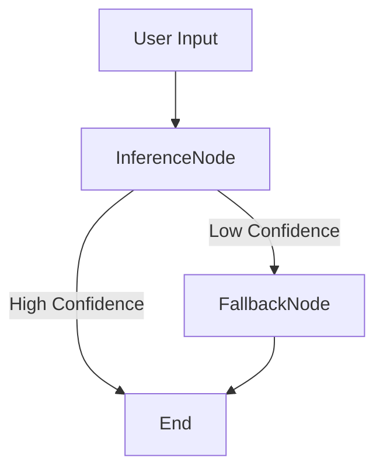

#  LangGraph Classifier: Confidence-Driven Text Classification with Fallback

**A self-healing NLP pipeline that doesn't just guess — it checks itself before it wrecks itself.**

---

##  Overview

This project is a **LangGraph-powered text classification system** designed to prioritize **correctness** over blind automation.

*  Fine-tuned DistilBERT model for sentiment analysis
*  Confidence-check mechanism using LangGraph DAG
*  Fallback strategies: **zero-shot classifier** or **manual user clarification**
*  Clean CLI interface with **explainable predictions**
*  Logging for decisions, confidence, and fallback tracking

---

##  Features

*  **Transformer fine-tuning (LoRA)** on a sentiment dataset
*  **Modular LangGraph DAG** with custom nodes:

  * `InferenceNode`: Makes the prediction
  * `ConfidenceCheck`: Decides if prediction is confident enough
  * `FallbackNode`: Asks for clarification or uses zero-shot
*  **CLI Loop** for interaction with user
*  **Logging system** for predictions, fallback use, and confidence scores
*  Smart defaults but totally hackable

---

##  Quickstart

###  Installation

```bash
git clone https://github.com/<your-username>/Langgraph-Classifier.git
cd Langgraph-Classifier
pip install -r requirements.txt
```

---

###  Model Setup

Since GitHub hates large files, download the fine-tuned model from here:

 [Download Fine-tuned DistilBERT (Google Drive)](https://drive.google.com/drive/folders/1Pc0qavHOBYGJQhymgKH1B1txiql4u7KE)

After downloading, **extract the model into the root folder** like this:

```
Langgraph-Classifier/
├── model/
│   ├── config.json
│   ├── pytorch_model.bin
│   ├── tokenizer.json
│   └── ...
```

---

###  Run the Classifier

```bash
python cli_interface.py
```

You'll see:

```
 Welcome to the LangGraph Classifier CLI!
Type a sentence to classify (or type 'exit' to quit):
```

Example:

```
> This movie was painfully slow and boring.

 Classifying input text...
[InferenceNode] Predicted label: Positive | Confidence: 0.52
[ConfidenceCheckNode] Confidence too low. Triggering fallback...
[FallbackNode] Did you mean this to be a POSITIVE or NEGATIVE statement?
User: Negative
Final Label: Negative 
```

---

##  LangGraph DAG Design

Here's how the pipeline flows:



---

##  Project Structure

```
Langgraph-Classifier/
├── classifier_graph.py     # LangGraph DAG + Nodes
├── cli_interface.py        # CLI loop
├── train_model.py          # Fine-tune DistilBERT using LoRA
├── load_data.py            # Dataset prep
├── logs/                   # Prediction + fallback logs
├── model/                  # (Ignored by git)
├── requirements.txt
└── README.md
```

---

##  Logging Output

Every prediction is logged with:

* Timestamp
* Input sentence
* Predicted label
* Confidence score
* Whether fallback was used

Logs live in `/logs/classification_log.txt`

---


##  Credits

* ⚙ Built by [Afham2263](https://github.com/Afham2263)
*  Powered by 🤗 Hugging Face +  LangGraph +  PyTorch


---

##  License

MIT.


